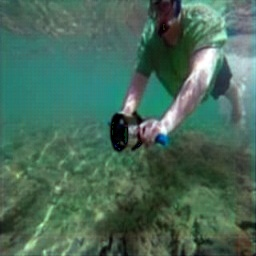
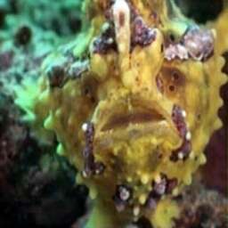

# Underwater Image Enhancement with U-Net

## Overview

This project enhances underwater images using a Convolutional Neural Network (CNN) based on the U-Net architecture. Implemented in Keras, the model improves image quality by addressing issues like color distortion, low contrast, and poor visibility.
## Dataset
- The EUVP (Enhancing Underwater Visual Perception) dataset contains separate sets of paired and unpaired image samples of poor and good perceptual quality to facilitate supervised training of underwater image enhancement models.
- Underwater Dark: 5550 training pairs, 570 validation pairs, and a total of 11670 images.
- Underwater ImageNet: 3700 training pairs, 1270 validation pairs, and a total of 8670 images.
- Underwater Scenes: 2185 training pairs, 130 validation pairs, and a total of 4500 images.

## Features

- **U-Net Model**: Enhances underwater images effectively using downsample and upsample paths with skip connections.
- **Comprehensive Enhancement**: Balances colors, improves contrast, and adjusts brightness and saturation.
- **Evaluation Metrics**: Uses PSNR and SSIM to measure the quality of enhanced images.

## Enhancement Techniques

1. **RGB Equalization**: Balances colors in the image.
2. **Histogram Stretching**: Enhances contrast.
3. **HSV Stretching**: Adjusts brightness and saturation.

## Getting Started

### Prerequisites

- Python 3.8+
- TensorFlow, Keras, OpenCV, Flask, React

### Installation

1. Clone the repository:
   ```bash
   git clone https://github.com/your-username/underwater-image-enhancement.git
   cd underwater-image-enhancement

## Usage
- Training the Model
  1. Prepare your image datasets and list their paths in train.csv, validation.csv, and test.csv.
  2. Train the model:
     ```bash
       python train_model.py
     ```
## Running the Web Application
1. Start the Flask backend:
   Note :- create virtual environment first then do below steps 
   - Go in backend directory
     ```bash
       cd backend
     ```
   - Run virtual Environment
     ```bash
       venv/Scripts/activate
     ```
   - Start server
     ```bash
      python server.py
     ```
3. Start the React frontend:
   Note :- install node modules first then reun below code
   - Go in frontend directory
     ```bash
       cd frontend
     ```
   - run react app
     ```bash
       npm run dev
     ```
## Model and Evaluation
The U-Net model uses convolutional layers to downsample and upsample the image, with skip connections to retain spatial information. The model is trained using mean squared error loss and evaluated with PSNR and SSIM metrics.

## Results
Enhanced images consistently show improved quality in terms of color balance, contrast, and clarity

| Input Image | Output Image |
|-------------|--------------|
|  |  |
|  |  |
|  |  |
|  |  |

